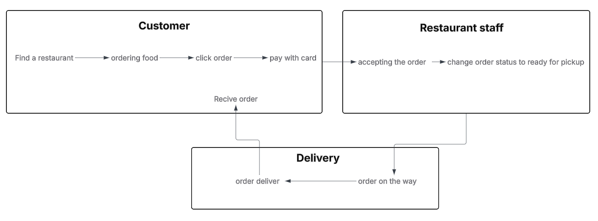

# Quick Start

Flavor fusion is a online **food ordering and delivery platform** designed to offer all features to modern standards.
### basic flow

```md
<script setup>
import { useData } from 'vitepress'

const { theme, page, frontmatter } = useData()
</script>

## Results

### Theme Data
<pre>{{ theme }}</pre>

### Page Data
<pre>{{ page }}</pre>

### Page Frontmatter
<pre>{{ frontmatter }}</pre>
```

<script setup>
import { useData } from 'vitepress';

const { site, theme, page, frontmatter } = useData()
</script>

## Results

### Theme Data
<pre>{{ theme }}</pre>

### Page Data
<pre>{{ page }}</pre>

### Page Frontmatter
<pre>{{ frontmatter }}</pre>

## More
::: info You will learn
- How to create and nest components
- How to add markup and styles
- How to display data
- How to render conditions and lists
- How to respond to events and update the screen
- How to share data between components
  :::
Check out the documentation for the [full list of runtime APIs](https://vitepress.dev/reference/runtime-api#usedata).
