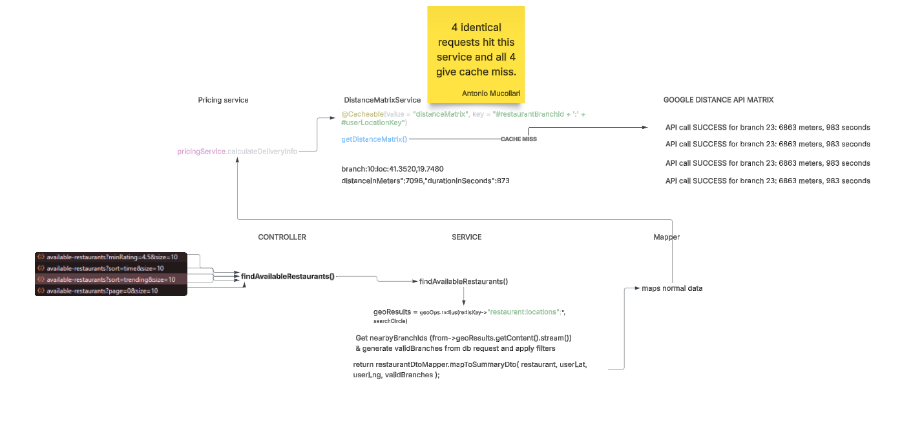

# Multiple Api call to google api matrix for the identical venue

```text

2026-05-08T12:32:50.814+02:00  INFO 33800 --- [FoodApp] [nio-8080-exec-7] c.t.F.r.service.DistanceMatrixService    : Calling Distance Matrix API for branch 4 from 41.32934441,19.78429205 to 41.36807700,19.70940020

2026-05-08T12:32:50.833+02:00  INFO 33800 --- [FoodApp] [nio-8080-exec-5] c.t.F.r.service.DistanceMatrixService    : Calling Distance Matrix API for branch 4 from 41.32934441,19.78429205 to 41.36807700,19.70940020

2026-05-08T12:32:50.841+02:00  INFO 33800 --- [FoodApp] [nio-8080-exec-6] c.t.F.r.service.DistanceMatrixService    : Calling Distance Matrix API for branch 4 from 41.32934441,19.78429205 to 41.36807700,19.70940020

2026-05-08T12:32:51.291+02:00  INFO 33800 --- [FoodApp] [nio-8080-exec-6] c.t.F.r.service.DistanceMatrixService    : API call SUCCESS for branch 4: 9464 meters, 660 seconds

2026-05-08T12:32:51.291+02:00  INFO 33800 --- [FoodApp] [nio-8080-exec-5] c.t.F.r.service.DistanceMatrixService    : API call SUCCESS for branch 4: 9464 meters, 660 seconds

2026-05-08T12:32:51.291+02:00  INFO 33800 --- [FoodApp] [nio-8080-exec-7] c.t.F.r.service.DistanceMatrixService    : API call SUCCESS for branch 4: 9464 meters, 660 seconds

2026-05-08T12:32:51.296+02:00  INFO 33800 --- [FoodApp] [nio-8080-exec-6] c.t.F.r.service.DistanceMatrixService    : Calling Distance Matrix API for branch 5 from 41.35409335,19.74910837 to 41.36807700,19.70940020

2026-05-08T12:32:51.296+02:00  INFO 33800 --- [FoodApp] [nio-8080-exec-7] c.t.F.r.service.DistanceMatrixService    : Calling Distance Matrix API for branch 5 from 41.35409335,19.74910837 to 41.36807700,19.70940020

2026-05-08T12:32:51.296+02:00  INFO 33800 --- [FoodApp] [nio-8080-exec-5] c.t.F.r.service.DistanceMatrixService    : Calling Distance Matrix API for branch 5 from 41.35409335,19.74910837 to 41.36807700,19.70940020

2026-05-08T12:32:51.444+02:00  INFO 33800 --- [FoodApp] [nio-8080-exec-6]
....
....
```


If you scroll to the right you can see the exact identical api calls waisting elements and therefore waisting money.
> 
> This can only happen if the venue is in present in multiple filters but for me this happen a lot.


---
### Why it did not work even with `sync = true`?
```java
@Cacheable(value = "distanceMatrix", key = "#restaurantBranchId + ':' + #userLocationKey", sync = true)
```
Because of Race Condition
```text
2026-05-08T12:32:50.814+02:00 INFO 33800 --- [FoodApp] [nio-8080-exec-7]...
2026-05-08T12:32:50.833+02:00 INFO 33800 --- [FoodApp] [nio-8080-exec-7]...
```
see the timings are identical.
> [!INFO]
> A cache is designed to speed up requests that happen seconds, minutes, or hours apart. It is NOT designed to act as a traffic cop for a spamming frontend.

### How I solved the issue
Instead of calling same endpoint three times I created a wrapper controller method which gives the result of 4 singular endpoints `getDashboardData()`.
The wrapper baisically calls the actual service `findAvailableRestaurants()` with the sort, filters that the frontend previously used. Now there is no cache miss.
Now when a customer only want a single `Page<RestaurantSummaryDTO>`, I can call the previous method `findAvailableRestaurants` and give no filters and sort.

## After the fix
```text

2026-05-09T14:38:58.002+02:00  INFO 4572 --- [FoodApp] [nio-8080-exec-9] c.t.F.r.service.DistanceMatrixService    : Calling Distance Matrix API for branch 18 from 41.31975337,19.81858123 to 41.35348710,19.74897390
2026-05-09T14:38:58.174+02:00  INFO 4572 --- [FoodApp] [nio-8080-exec-9] c.t.F.r.service.DistanceMatrixService    : API call SUCCESS for branch 18: 9717 meters, 882 seconds
2026-05-09T14:38:58.174+02:00  INFO 4572 --- [FoodApp] [nio-8080-exec-9] c.t.F.r.service.DistanceMatrixService    : Calling Distance Matrix API for branch 17 from 41.32147407,19.79401940 to 41.35348710,19.74897390
2026-05-09T14:38:58.329+02:00  INFO 4572 --- [FoodApp] [nio-8080-exec-9] c.t.F.r.service.DistanceMatrixService    : API call SUCCESS for branch 17: 6270 meters, 520 seconds
2026-05-09T14:38:58.332+02:00  INFO 4572 --- [FoodApp] [nio-8080-exec-9] c.t.F.r.service.DistanceMatrixService    : Calling Distance Matrix API for branch 19 from 41.32732432,19.82258346 to 41.35348710,19.74897390
2026-05-09T14:38:58.488+02:00  INFO 4572 --- [FoodApp] [nio-8080-exec-9] c.t.F.r.service.DistanceMatrixService    : API call SUCCESS for branch 19: 7438 meters, 1144 seconds
2026-05-09T14:38:58.490+02:00  INFO 4572 --- [FoodApp] [nio-8080-exec-9] c.t.F.r.service.DistanceMatrixService    : Calling Distance Matrix API for branch 16 from 41.35397911,19.74911714 to 41.35348710,19.74897390
2026-05-09T14:38:58.629+02:00  INFO 4572 --- [FoodApp] [nio-8080-exec-9] c.t.F.r.service.DistanceMatrixService    : API call SUCCESS for branch 16: 81 meters, 36 seconds
2026-05-09T14:38:58.640+02:00  INFO 4572 --- [FoodApp] [nio-8080-exec-9] c.t.F.r.service.DistanceMatrixService    : Calling Distance Matrix API for branch 6 from 41.32136250,19.79485940 to 41.35348710,19.74897390

```