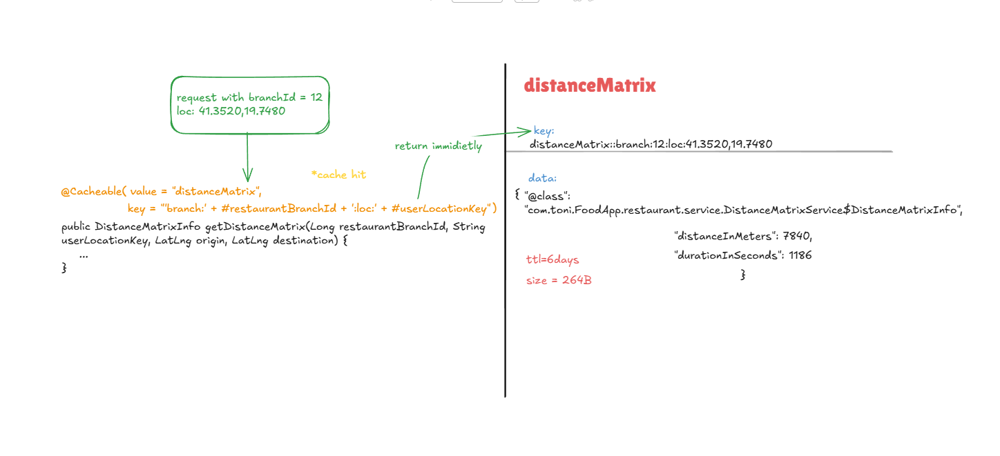

# Restaurant Caching

[Pyramid of caching](cachingPyramid.png){target="_blank"}\
This platform is heavy featured with caching for the restaurants & venues. All caching is done in redis keeping the backend stateless.
Let's start from level two caching which is distanceMatrix:
## DistanceMatrix 
\
DistanceMatrixService uses Spatial Caching for the api call with Google Distance Matrix API and this works when a different customer within 400m m radius makes a request.
The caching is done from the userLocation key and I have rounded the lat and long to 3 decimal ex: 41.324,19.822". So similar users within 400m meters can get identical results.
that we can map to our branchSummaryDto inside the mapper.
If no error occurs, the method returns a ``RestaurantSummaryDTO``.
Time to live is 6 Days the reason is because the restaurants will not change the location very often (I implemented cache evict for this scenario) but what you might think is that user would never come online
and Im saving stale data but this is not only for one user but multiple users in same area and also I calculated:\
Tirana area = 41.3 km²
Each cell   = 0.4km × 0.4km = 0.16 km²

Unique zone keys = 41.3 / 0.16 = ~258 zones
× 20 branches    = 5,160 keys
× 264B           = **~1.36 MB**\
Completely negligible.\
I only chach ids of the venues and not the actual information like name, address, phone number...etc. This is done to prevent execive calling to the google api matrix.
```java
    // cache ~400m radius
    private String getUserLocationCacheKey(double lat, double lon) {
        int precision = 250;

        double latKey = Math.floor(lat * precision) / precision;
        double lonKey = Math.floor(lon * precision) / precision;

        return String.format("%.4f,%.4f", latKey, lonKey);
    }
```

## DashboardRestaurants
This is the most aggresive caching and come before the distance matrix. This is cached for smallest time due to stale data in redis for long period of time and can fill up ram fast.
So basically this cache the `Page<RestaurantSummaryDTO>` but with a wrapper [serializablePage](../../specific/serializablePage.md) because without it it can't serialize.
[Example on Redis Insight.](./dashboardRestaurants.png){target="_blank"}\
cache key: `dashboardRestaurants::delivery_time:0:41.353,19.749`
| PartValue         | Meaning                            |
|-------------------|------------------------------------|
| cache name        | dashboardRestaurants              |
| sort              | default                            |
| pageNumber        | 0                                  |
| roundedLat        | 41.353                             |
| roundedLon        | 19.749                             |
| cache purpose     | Rounded user location grid cell    |

### Results
Before caching 43ms for the request\
After the cache 16ms, approximate:260% faster
(Not considering latency)