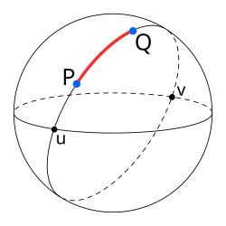
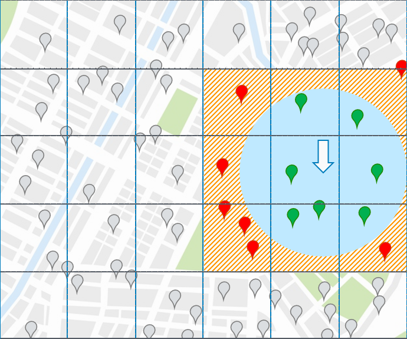
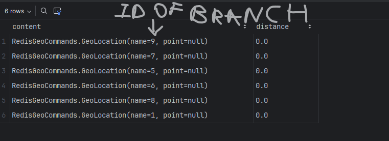

# FOOD FUSION DOCUMENTATION

#### In this documentation, the focus is not on the technical rules or structure of writing documentation, but rather explaining the system itself. Im trying to write this short and concise.
*Writing time: 1/1/2026*\
I will write this in story form.
## The Discovery Page
How is the discovery page [frontendUrl/discovery](http://localhost:5173/discovery) fetched.
Discovery page is arguably the hardest part in building the software.
I will start by explaining not in code but in logic.
Many users (“CUSTOMERS”) are looking for food to eat, and the discovery’s job is to show only available restaurant branches ex.: KFC (this is the restaurant) Deliorgji (this is the restaurant branch or child of the restaurant). 
Those branches cards will contain info such total time when the order arrive, distance of the branch, delivery price and the name of restaurant with branch location.\
### What defines available
* The branch is active (not closed).
  * It has a manager assigned.
  * It is within the delivery range of and other things that would make placing the order not possible at the end.\
  This is possible through a large and multifunctional endpoint

```java
    @GetMapping("/available-restaurants")
public ResponseEntity<Response<Page<RestaurantSummaryDTO>>> findAvailableRestaurants(
        @ModelAttribute RestaurantFilterCriteria criteria,
        @PageableDefault(size = 10, page = 0) Pageable pageable,
        @RequestParam(required = false, defaultValue = "default") String sort

) {
    return ResponseEntity.ok(restaurantService.findAvailableRestaurants(criteria,pageable,sort));
}
```
This endpoint is the highest level of abstraction, and we will go down level by level.\
### **Firstly, lets understand how the restaurant branches are picked based on distance because this is crucial:**
* **User Location:** Stored in the `delivery_location` table as simple `double precision` columns (`latitude`, `longitude`).
  * **Restaurant Location:** Stored in the `restaurant_locations` table using the complex `POINT` (Geometry) format.
```java
@Column(columnDefinition = "geography(Point,4326)")
private Point location;
```
Why restaurant location is saved in POINT format and not double like the user location?
Let say both are stored in double precision, in this scenario we would use **haversine formula**
\
to calculate distance between the two points.
This would be generally fine but when the app scales, the calculations would take a lot of server processing power and would slow the app, O(N) (Linear Complexity).
* Secondly every time the user refreshes the page or a neighbor opens the app, 
  we would expect the app to show identical results if timing is relatively short but this approach requires caching and this method does not provide it.\
  * 
#### The solution
is to use **redis geospatial indexing** with postgis extension.\
How this works
When server start up this method is triggered

```java
@PostConstruct
public void rebuildGeoIndexOnStartup() {
    // 1. Fetch Source of Truth
    List<RestaurantBranch> allBranches = branchRepository.findAll();

    // 2. Clear old Cache
    redisTemplate.delete(REDIS_GEO_KEY);

    // 3. Convert & Prepare Data
    var locations = allBranches.stream()
            .filter(branch -> branch.getLocation() != null)
            .map(branch -> {
                // Converting JTS Point (SQL) to Spring Geo Point (Redis)
                var jtsPoint = branch.getLocation(); 
                var redisPoint = new Point(jtsPoint.getX(), jtsPoint.getY());

                // Mapping Branch ID to the Coordinate
                return new RedisGeoCommands.GeoLocation<>(
                        String.valueOf(branch.getId()), 
                        redisPoint
                );
            })
            .collect(Collectors.toList());

    // 4. Push to Redis
    geoOps.add(REDIS_GEO_KEY, locations);
}
```
Since Redis is an in-memory store (volatile), we cannot assume it holds data when the server restarts. We must "hydrate" or "warm up" the cache immediately upon startup.\
What the above method does is:
* Fetch all restaurant branches from the database.
  * Clear the old cache.
  * Convert the JTS Point (SQL) to Spring Geo Point (Redis).
    * Push the converted data to Redis.\
    **This is also implemented when a new restaurant branch is added or updated.**
    Now that we have the cache ready, we can use the `geoRadius` method to find nearby branches.\
    Let's go back to the initial method "findAvailableRestaurants" and see how it works.
    Lets ignore the sorting and filtering for now and focus more on finding the restaurants\
    inside the method findAvailableRestaurants is this code 
```java
//We ask redisTemplate for a specific set of tools called opsForGeo().
GeoOperations<String, String> geoOps = redisTemplate.opsForGeo();
//we stored all those branch coordinates during the cache warm-up here
String redisKey = "restaurant:locations";

// Defining the Limit
Distance searchRadius = new Distance(MAX_SYSTEM_DELIVERY_RADIUS_KM, RedisGeoCommands.DistanceUnit.KILOMETERS);
//Defining the Center
org.springframework.data.geo.Point userPoint = new org.springframework.data.geo.Point(userLongitude, userLatitude);

//Drawing the Shape true circle
Circle searchCircle = new Circle(userPoint, searchRadius);
//It looks at its spatial index (Geohashes) and instantly picks out every ID that falls inside that circle.
GeoResults<RedisGeoCommands.GeoLocation<String>> geoResults = geoOps.radius(redisKey, searchCircle);

```
\
In this image the sqares are sqares set by redis and size is automaticlly decided based on the searchCircle. REDIS initially searches for the 9 sqares and is very fast than decides what to keep depending on the circle.
At the end it returns GeoResults, which is a list wrapper containing all the Branch IDs (name string) that were found.
\
We're grabbing the IDs from the geo-search results and converting them into a list of Longs "nearbyBranchIds".
### How it returns the restaurant branches after getting the IDs
Now that we have the id for the location available restaurants branches we are 
not finished because there are more [validations](#what-defines-available) that we have to do like to apply like what we discussed in the beginning.
Also, we need the restaurant card info like 
```java


public class RestaurantSummaryDTO {
    private Long id;
    private String name;
    private String description;
    private String coverImageUrl;
    private String profileImageUrl;
    private boolean isPromoted;
    private LocalDateTime createdAt;
    private List<RestaurantCategoryDTO> categories;
    private List<BranchSummaryDto> branches;
}
```
### BranchSummaryDto
```java
//BranchSummaryDto is the hardest part that we will return because we will
// generate from other functions and all the values in RestaurantSummaryDTO are located in db.
    private Long id;
    private String address;
    private String phoneNumber;
    private boolean isActive = true;
    private double latitude;
    private double longitude;
    private double distanceInKm;
    private String deliveryTime;
    private BigDecimal deliveryPrice;
    private BigDecimal rating;
    private Integer roundedReviewCount;
    private Integer minOrderAmount;
    private Integer dailyOrderCount;
```

#### First lets get the restaurants & branches from the repository. 
User can have many filters at the same time for example they can filter for both is new and min order amount so we handle this at repository layer.

In contrary the sort can only be one at the time and we handle this at service layer, we use switch for this.
```
        switch (String.valueOf(sort).toLowerCase()) {
            case "rating":
                entityPage = restaurantRepository.findDynamicAndRankedByRating(
                        nearbyBranchIds, userLongitude, userLatitude, criteria, repoPageable);
                message = "Restaurants sorted by rating retrieved successfully.";
                break;

            case "prep_time":
                entityPage = restaurantRepository.findDynamicAndRankedByPrepTime(
                        nearbyBranchIds, userLongitude, userLatitude, criteria, repoPageable);
                message = "Restaurants sorted by prep time retrieved successfully.";
                break;

            case "default":
            default:
                entityPage = restaurantRepository.findDynamicAndRankedByDefault(
                        nearbyBranchIds, userLongitude, userLatitude, criteria, repoPageable);
                message = "Restaurants retrieved successfully.";
                break;
        }

```

When a search request comes in, the system starts with a master query that gathers all valid, 
nearby restaurants and filters them based on the user’s specific criteria. Before sending the results back, 
the code dynamically decides how to rank them—prioritizing either promoted spots, 
high ratings, or fast prep times—by attaching the correct sorting instruction to the end of that master query.
example in repository
```java
    @Query(value = BASE_SELECT + BASE_WHERE_DYNAMIC + BASE_GROUP_BY + ORDER_BY_DEFAULT, countQuery = BASE_COUNT, nativeQuery = true)
    Page<Restaurant> findDynamicAndRankedByDefault(
            @Param("branchIds") List<Long> branchIds, @Param("userLon") double userLon, @Param("userLat") double userLat,
            @Param("criteria") RestaurantFilterCriteria criteria, Pageable pageable
    );

    // Sort by Rating
    @Query(value = BASE_SELECT + BASE_WHERE_DYNAMIC + BASE_GROUP_BY + ORDER_BY_RATING, countQuery = BASE_COUNT, nativeQuery = true)
    Page<Restaurant> findDynamicAndRankedByRating(
            @Param("branchIds") List<Long> branchIds, @Param("userLon") double userLon, @Param("userLat") double userLat,
            @Param("criteria") RestaurantFilterCriteria criteria, Pageable pageable
    );
```
base dynamic contain all validation,filtering

This will return a Pagable Restaurant object which will be converted to RestaurantSummaryDTO in our mapper.
### Generate BranchSummaryDTO
Now we need to generate [BranchSummaryDTO](#BranchSummaryDto) inside the mapper.
This is done by other helper services like calculateDeliveryInfo inside PricingService and pricing service uses other helper methods like DistanceMatrixService which makes a request to DistanceMatrixApi for distance in meters, which uses other methods to reutrn this DeliveryInfo dto.
```java
public class DeliveryInfo {
    private final BigDecimal deliveryFee;
    private final String deliveryTime;

    private final double distanceInKcm;
    private final long distanceInMeters;
    private final long durationInSeconds;

    private final boolean isDeliverable;
}
```
DistanceMatrixService uses Spatial Caching for the api call with Google Distance Matrix API and this works when a different customer within 100x100 m  makes a request.
The caching is done from the userLocation key and I have rounded the lat and long to 3 decimal ex: 41.325,19.822". So similar users within 100 meters can get identical results.
that we can map to our branchSummaryDto inside the mapper.
If no error occurs, the method returns a [RestaurantSummaryDTO](#what-defines-available).


::: info
**What you will learn**
* How to use redis geospatial indexing to find nearby branches.
* How to use redis geospatial indexing to find nearby branches.
* How to use redis geospatial indexing to find nearby branches.
:::